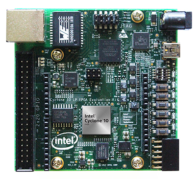

# Intel-Cyclone-10-LP-Evaluation-Board
Repositorio de proyectos basados en la tarjeta de evaluación Intel Cyclone 10 LP 
A repository of my developments for the Intel Cyclone 10 LP Evaluation Kit 
 

Introducing Intel Cyclone 10 LP FPGA Evaluation Kit - http://www.branetronics.com/clockfabric/category/cyclone-10-lp-fpga-eval-kit 
ClockFabric Video 001: Introducing Intel Cyclone 10 LP FPGA Evaluation Kit - https://www.youtube.com/watch?v=w_FmjOG6kxQ 
ClockFabric Video 002: Installing Quartus Prime Lite 17.1 and the Board Test System - https://www.youtube.com/watch?v=7uVBHrBIuew 
ClockFabric Video 003: Exploring Quartus Prime Lite 17.1 and Creating a New Projecthttps://www.youtube.com/watch?v=jxkNilK__yE 
Dig-Key Daily: Intel® Cyclone® 10 LP FPGAs - https://www.youtube.com/watch?v=y5Lh6lA7ARc 
Digitronix Nepal: Altera Cyclone 10 LP FPGA Board Programming with Quartus Prime Lite Software - https://www.youtube.com/watch?v=rmsuWwZfjDs

 
<b>Changelog:</b> 
2024/06/23 - Latest supported Quartus Prime Lite version for Cyclone 10 LP devices is 23.1.1. NIOS II is discontinued as of now, new designs should use the new NIOS V processor. Ref: Intel (2023/06/09). Product Discontinuance Notification PDN2312. https://www.intel.com/content/www/us/en/content-details/781327/intel-is-discontinuing-ip-ordering-codes-listed-in-pdn2312-for-nios-ii-ip.html 

 
<b>References:</b> 
- Intel (2024). Quartus Prime Design Software. https://www.intel.com/content/www/us/en/products/details/fpga/development-tools/quartus-prime/resource.html
- Intel (2020). Cyclone 10 LP Device Overview. https://www.intel.com/content/www/us/en/docs/programmable/683879/current/device-overview.html 
- Intel (2020). Cyclone 10 LP FPGA Evaluation Kit. https://www.intel.com/content/www/us/en/products/details/fpga/development-kits/cyclone/10-lp-evaluation-kit.html 
- Intel (2023). Nios® V Processor for Intel® FPGA. https://www.intel.com/content/www/us/en/products/details/fpga/intellectual-property/processors-peripherals/niosv.html 
- Intel (2017). Cyclone 10 LP Nios II 'Hello World' Lab Manual. https://www.intel.com/content/dam/support/us/en/programmable/support-resources/fpga-wiki/asset03/c10lp-nios-ii-hello-world-lab-manual.pdf 
- Intel Learning (2023). Intel® FPGA On-Demand eLearning. https://learning.intel.com/developer/pages/128/intelr-fpga-training 
- Macnica (2025). First LED blinking with Altera® FPGA's Nios® V! Part 1: Hardware development (Quartus® Prime Standard Edition). https://www.macnica.co.jp/en/business/semiconductor/articles/altera/113961/ 
- Macnica (2025). First LED blinking with Altera® FPGA's Nios® V! Part 2: Software development (Quartus® Prime Standard Edition). https://www.macnica.co.jp/en/business/semiconductor/articles/altera/114097/ 

 
<b>Video References:</b> 
- SiFiveInc (2019). Part I: An Introduction to the RISC-V Architecture. https://www.youtube.com/watch?v=m8DqCTogb8w 
- ClockFabric (2018). Introducing Intel Cyclone 10 LP FPGA. https://www.youtube.com/watch?v=w_FmjOG6kxQ&list=PLFfHucesVFJIsXRupVNl27LgeE_31wdYw 
- Weber Luo (2023). Build a Soft Core CPU - Part Three - NIOS II in Intel FPGA. https://www.youtube.com/watch?v=ViHD-lVTHJ8 
- Digitronix Nepal (2019). Altera Cyclone 10 LP FPGA Board Programming with Quartus Prime Lite Software. https://www.youtube.com/watch?v=rmsuWwZfjDs 
- FPGAWorld (2023). Implementación del procesador NIOS II en una FPGA-Introducción a Soft-processors Parte 3. https://www.youtube.com/watch?v=BF38mgi1D7Y 
- Troy Scevers (2023). Hello World - NIOS V. https://www.youtube.com/watch?v=c6t-MVQ_j8Y 
- Altera (2023). Nios® V Processor for Intel® FPGAs "Ask an Expert". https://www.youtube.com/watch?v=_lpuV10-_98 
- Altera (2022). Getting Started with Nios® V/m Processor (Part 1/3). https://www.youtube.com/watch?v=3Fwgsfbbcm4 
- FPGA Zealot (2024). Nios V RISC-V processor -- MAX 10 FPGA: Live Stream Part_000. https://www.youtube.com/watch?v=0n88EBO0zJI 
- Altera (2024). Nios® V Processors Overview. https://www.youtube.com/watch?v=S5CAuqUk_yE 

